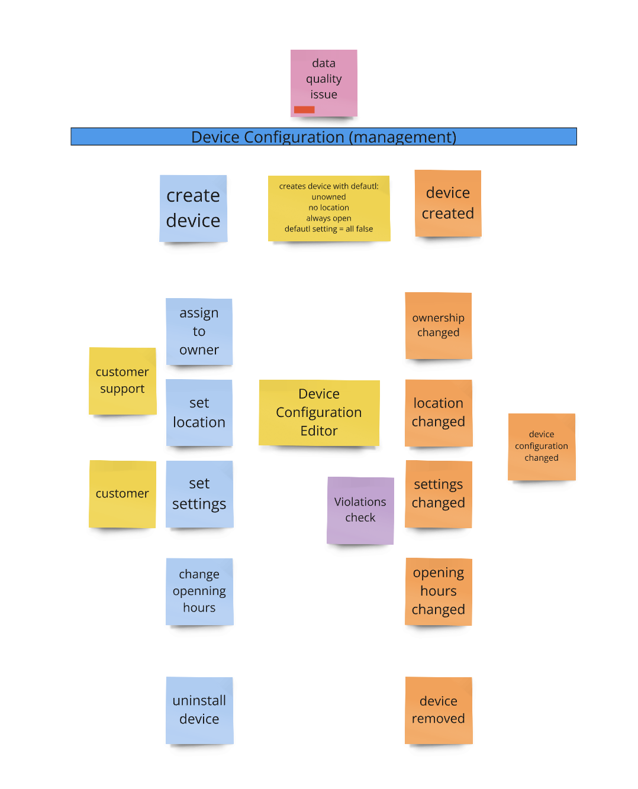

# Diagram


# Intro
Some information about device need to be stored in central system database (device itself is not aware about those informations).

Informations like:
ownership of device: operator (tenant), and provider (entity providing charging service)
location address and coordinates
opening hours: availability of device
some settings like: device should be public or not, visible on map etc.


## API Contract FE vs BE:

1. Read device details:
```
GET /devices/{deviceId}

{
  deviceId: "ALF-98262561",
  ownership: {
    operator: "Devicex.nl",
    provider: "public-devices"
  },
  location: {
    street: "Rakietowa",
    houseNumber: "1A",
    city: "Wrocław",
    postalCode: "54-621",
    country: "POL",
    coordinates: {
      longitude: 16.931752852309156,
      latitude: 51.09836221719513
    }
  },
  openingHours: {
    alwaysOpen: true
  },
  settings: {
    autoStart: false,
    remoteControl: false,
    billing: false,
    reimbursement: false,
    showOnMap: false,
    publicAccess: false
  }
}
```

2. Change device owner:
```
PATCH /devices/{deviceId}

{
  ownership: {
    operator: "Devicex.nl",
    provider: "public-devices"
  }
}
```
3. Set device UNOWNED:
```
PATCH /devices/{deviceId}

{
  ownership: {
    operator: null,
    provider: null
  }
}
```

3. Set new location:
```
PATCH /devices/{deviceId}

{
  location: {
    street: "Rakietowa",
    houseNumber: "2A",
    city: "Wrocław",
    postalCode: "54-621",
    country: "POL",
    coordinates: {
      longitude: 16.931752852309156,
      latitude: 51.09836221719513
    }
}
```

4. Change selectively some settings:
```
PATCH /devices/{deviceId}

{
  settings: {
    showOnMap: true,
    publicAccess: true
  }
}
```

**NOTE:** In the first **MVP** openingHours.alwaysOpen: true is the only option.


## Initial business rules:

new device should be configured as:
- UNOWNED - ownership with both operator and provider set to null
- location = null
- openingHours = Always Open
- settings = default settings (all false)

**NOTE**: For robustness, always keep ownership, openingHours, and settings as NOT NULL—use the above defaults instead.
For owned devices, both operator and provider in ownership must always be set.
In location only coordinates, longitude and latitude are mandatory.

More complex rules are already known, but will be defined in future tasks.


Task scope:
- for now please provide Domain Model without REST or database adapters
- junit tests for rules are required