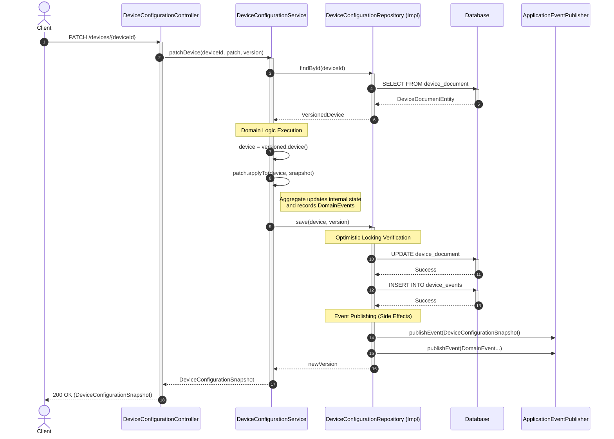

# Application Flow Diagram

## Device Configuration Update Flow

This diagram illustrates how a device configuration update (PATCH) is processed through the layers of the application, following the Domain-Driven Design and Ports & Adapters architecture.

