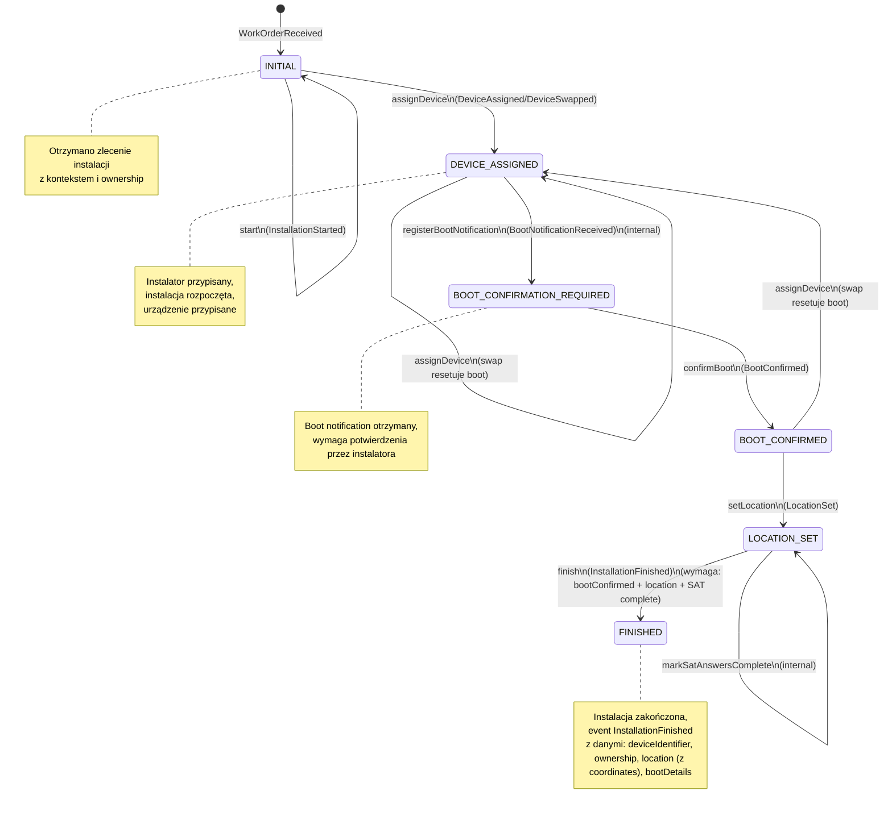

# Devices Configuration & Installation System

System zarządzania konfiguracją urządzeń IoT oraz procesem ich instalacji. Aplikacja obsługuje komunikację z urządzeniami przez protokoły IoT16 i IoT20, zarządza konfiguracją urządzeń (właścicielstwo, lokalizacja, godziny otwarcia, ustawienia) oraz koordynuje proces instalacji od zlecenia do zakończenia.

## Cel i kontekst biznesowy

System rozwiązuje następujące problemy biznesowe:

- **Konfiguracja urządzeń IoT**: Zarządzanie danymi urządzeń (właścicielstwo, lokalizacja GPS, godziny otwarcia, ustawienia operacyjne) z obsługą optymistycznego blokowania (If-Match header).
- **Komunikacja z urządzeniami**: Obsługa boot notification z protokołów IoT16 i IoT20, obliczanie heartbeat interval na podstawie reguł (device-id, model-vendor) oraz status urządzenia (UNKNOWN, IN_INSTALLATION, EXISTING).
- **Proces instalacji**: Koordynacja instalacji urządzeń od otrzymania zlecenia (Work Order) przez przypisanie instalatora, przypisanie urządzenia, potwierdzenie boot notification, ustawienie lokalizacji GPS, aż do zakończenia instalacji.

### Główne funkcjonalności

- **Boot Notification**: Urządzenia wysyłają boot notification przez protokoły IoT16/IoT20; system zwraca heartbeat interval i status (Accepted/Pending/Rejected).
- **Heartbeat Interval**: Obliczanie interwału na podstawie reguł konfiguracyjnych (device-id, vendor-model regex) lub wartości domyślnej (1800s).
- **Device Configuration**: Odczyt i częściowa aktualizacja konfiguracji urządzeń z wersjonowaniem i optymistycznym blokowaniem.
- **Installation Workflow**: Proces instalacji sterowany stanem `InstallationPhase` (obecnie używane: `INITIAL`, `DEVICE_ASSIGNED`, `BOOT_CONFIRMATION_REQUIRED`, `BOOT_CONFIRMED`, `LOCATION_SET`, `FINISHED`; wartość `FINAL` istnieje w enum, ale nie jest ustawiana przez aktualną implementację agregatu).

## Architektura

System wykorzystuje **Domain-Driven Design (DDD)** oraz wzorzec **Ports & Adapters (Hexagonal Architecture)**.

### Struktura pakietów

```
src/main/java/devices/
├── configuration/          # Moduł konfiguracji urządzeń
│   ├── communication/      # Komunikacja z urządzeniami (boot notification)
│   │   └── protocols/
│   │       ├── iot16/      # Adapter protokołu IoT16
│   │       └── iot20/      # Adapter protokołu IoT20
│   ├── management/         # Zarządzanie konfiguracją urządzeń
│   │   ├── DeviceConfiguration.java      # Aggregate (package-private)
│   │   ├── DeviceConfigurationService.java  # Primary port (Service)
│   │   ├── DeviceConfigurationController.java  # Primary adapter (HTTP)
│   │   ├── DeviceConfigurationRepository.java   # Secondary port (interface)
│   │   ├── DeviceConfigurationDocumentRepository.java  # Secondary adapter (JPA)
│   │   ├── DomainEvent.java                # Domain events (sealed interface)
│   │   └── [ValueObjects].java             # Value objects (records)
│   └── tools/              # Konfiguracja infrastruktury
│       ├── SecurityConfiguration.java
│       ├── KafkaConfiguration.java
│       └── ...
└── installation/           # Moduł procesu instalacji
    ├── Installation.java              # Aggregate (package-private)
    ├── InstallationService.java       # Primary port (Service)
    ├── InstallationController.java    # Primary adapter (HTTP)
    ├── InstallationRepository.java    # Secondary port (interface)
    ├── InstallationDocumentRepository.java  # Secondary adapter (JPA)
    ├── InstallationEvent.java         # Domain events (sealed interface)
    └── [ValueObjects].java            # Value objects (records)
```

### Zasady architektoniczne

- **Aggregates**: Klasa agregatu jest package-private, nie używa sufiksu "Aggregate", enkapsuluje logikę biznesową i stan.
- **Value Objects**: Immutabilne rekordy reprezentujące koncepty domenowe (np. `Ownership`, `Location`, `Coordinates`, `WorkOrderId`).
- **Domain Events**: Sealed interfaces z recordami reprezentującymi zdarzenia domenowe emitowane przez agregaty.
- **Ports & Adapters**: 
  - **Primary Ports**: Serwisy aplikacyjne (`*Service`) - fasady dla funkcjonalności modułu.
  - **Primary Adapters**: Kontrolery HTTP (`*Controller`) - adaptery REST API.
  - **Secondary Ports**: Repozytoria (`*Repository` interfaces) - kontrakty dla persistence.
  - **Secondary Adapters**: Implementacje JPA (`*DocumentRepository`) - adaptery do bazy danych.

### Diagram kontekstowy (C4 – uproszczony)

```mermaid
graph LR
    installer[Instalator] -->|HTTPS/JWT| sys[Devices Configuration System]
    operator[Operator/Administrator] -->|HTTPS/JWT| sys
    device[Urządzenie IoT] -->|HTTPS (permitAll)| sys

    sys -->|JWT validation (issuer-uri)| keycloak[Keycloak]
    sys -->|JDBC/JPA + Liquibase| postgres[(PostgreSQL)]
    sys -->|SASL_SSL/SCRAM| kafka[Apache Kafka]
    prometheus[Prometheus] -->|scrape /actuator/prometheus| sys
```

### Diagram przepływu procesu instalacji



## API REST

### Protokoły IoT (permitAll)

#### POST `/protocols/iot16/bootnotification/{deviceId}`

Boot notification dla protokołu IoT16.

**Request Body** (`BootNotificationRequest`):
```json
{
  "chargePointVendor": "Alfen BV",
  "chargePointModel": "NG920-52506",
  "chargePointSerialNumber": "SN123456",
  "chargeBoxSerialNumber": "EVB-P4562137",
  "firmwareVersion": "1.2.3",
  "iccid": "89012345678901234567",
  "imsi": "310150123456789",
  "meterType": "EM100",
  "meterSerialNumber": "METER123"
}
```

**Response** (`BootNotificationResponse`):
```json
{
  "currentTime": "2026-01-28T10:30:00Z",
  "interval": 600,
  "status": "Accepted"
}
```

**Statusy**: `Accepted` (urządzenie istnieje), `Pending` (w trakcie instalacji), `Rejected` (nieznane urządzenie).

#### POST `/protocols/iot20/bootnotification/{deviceId}`

Boot notification dla protokołu IoT20.

**Request Body** (`BootNotificationRequest`):
```json
{
  "device": {
    "serialNumber": "EVB-P4562137",
    "model": "NG920-52506",
    "vendorName": "Alfen BV",
    "firmwareVersion": "1.2.3",
    "modem": {
      "iccid": "89012345678901234567",
      "imsi": "310150123456789"
    }
  },
  "reason": "PowerUp"
}
```

**Response**: Analogiczny do IoT16.

### Zarządzanie urządzeniami (authenticated)

#### GET `/devices/{deviceId}`

Pobiera konfigurację urządzenia.

**Response** (`DeviceConfigurationSnapshot`):
```json
{
  "deviceId": "EVB-P4562137",
  "ownership": {
    "operator": "OPERATOR_A",
    "provider": "PROVIDER_B"
  },
  "location": {
    "street": "Przykładowa",
    "houseNumber": "1",
    "city": "Warszawa",
    "postalCode": "00-001",
    "state": "Mazowieckie",
    "country": "PL",
    "coordinates": { "longitude": 21.0122, "latitude": 52.2297 }
  },
  "openingHours": { "alwaysOpen": true },
  "settings": {
    "autoStart": true,
    "remoteControl": true,
    "billing": true,
    "reimbursement": false,
    "showOnMap": true,
    "publicAccess": true
  },
  "violations": {
    "operatorNotAssigned": false,
    "providerNotAssigned": false,
    "locationMissing": false,
    "showOnMapButMissingLocation": false,
    "showOnMapButNoPublicAccess": false
  },
  "visibility": {
    "forCustomer": "USABLE_AND_VISIBLE_ON_MAP",
    "roamingEnabled": true
  }
}
```

#### PATCH `/devices/{deviceId}`

Aktualizuje konfigurację urządzenia (wymaga `If-Match` header z wersją).

**Headers**:
- `If-Match: <version>` (opcjonalny, jeśli brak - używa aktualnej wersji)

**Request Body** (`DeviceConfigurationPatch`):
```json
{
  "ownership": {
    "operator": "OPERATOR_A",
    "provider": "PROVIDER_B"
  },
  "location": {
    "street": "Nowa",
    "houseNumber": "2",
    "city": "Kraków",
    "postalCode": "30-001",
    "state": "Małopolskie",
    "country": "PL",
    "coordinates": { "longitude": 19.9445, "latitude": 50.0647 }
  },
  "openingHours": { "alwaysOpen": true },
  "settings": {
    "autoStart": false,
    "remoteControl": true
  }
}
```

**Response**: `DeviceConfigurationSnapshot` (zaktualizowany).

**Statusy**: `200 OK`, `404 Not Found`, `409 Conflict` (OptimisticLockException).

### Proces instalacji (authenticated)

#### GET `/installations/{workOrderId}`

Pobiera stan instalacji.

**Response** (`InstallationSnapshot`):
```json
{
  "workOrderId": "WO-12345",
  "phase": "BOOT_CONFIRMED",
  "assignedInstallerId": "INST-001",
  "ownership": { "operator": "OPERATOR_A", "provider": "PROVIDER_B" },
  "context": {
    "segment": "PUBLIC",
    "country": "PL",
    "equipmentCategory": "EV_CHARGER",
    "customerId": "CUST123"
  },
  "deviceIdentifier": "EVB-P4562137",
  "lastRelevantBoot": {
    "vendor": "Alfen BV",
    "model": "NG920-52506",
    "firmware": "1.2.3",
    "serial": "EVB-P4562137",
    "protocol": "IoT20"
  },
  "bootConfirmed": true,
  "location": {
    "longitude": 21.0122,
    "latitude": 52.2297
  },
  "allMandatorySatAnswered": true,
  "canFinish": true
}
```

#### POST `/installations/{workOrderId}/assign`

Przypisuje instalatora do zlecenia.

**Request Body**:
```json
{
  "installerId": "INST-001",
  "forceReassign": false
}
```

#### POST `/installations/{workOrderId}/start`

Rozpoczyna instalację (emituje `InstallationStarted`). W aktualnej implementacji agregatu wywołanie to **nie zmienia** `phase` — przejście do `DEVICE_ASSIGNED` następuje dopiero po `assignDevice`.

#### POST `/installations/{workOrderId}/device`

Przypisuje urządzenie do instalacji.

**Request Body**:
```json
{
  "deviceIdentifier": "EVB-P4562137"
}
```

#### POST `/installations/{workOrderId}/boot-confirmation`

Potwierdza boot notification (przejście do BOOT_CONFIRMED).

#### POST `/installations/{workOrderId}/location`

Ustawia lokalizację GPS instalacji.

**Request Body**:
```json
{
  "coordinates": {
    "longitude": 21.0122,
    "latitude": 52.2297
  }
}
```

#### POST `/installations/{workOrderId}/finish`

Kończy instalację (waliduje inwarianty, emituje `InstallationFinished` event).

Uwaga: aby `finish` zadziałało, agregat wymaga spełnienia warunków `canFinish == true`, czyli: `bootConfirmed == true`, `location != null`, `allMandatorySatAnswered == true`.

## Konfiguracja

### Zmienne środowiskowe

#### Kafka

- `KAFKA_BOOTSTRAP_SERVERS` - Adresy brokerów Kafka (np. `kafka1:9093,kafka2:9093`)
- `KAFKA_JAAS_USERNAME` - Username dla SASL/SCRAM
- `KAFKA_JAAS_PASSWORD` - Hasło dla SASL/SCRAM
- `KAFKA_SSL_TRUST_STORE_LOCATION` - Ścieżka do truststore (np. `/etc/ssl/certs/kafka-truststore.jks`)
- `KAFKA_SSL_TRUST_STORE_PASSWORD` - Hasło do truststore

#### OAuth2 / Keycloak

- `spring.security.oauth2.resourceserver.jwt.issuer-uri` - URI wydawcy JWT (domyślnie: `https://keycloak.auth/realms/iot`)

#### PostgreSQL

Konfiguracja przez `spring.datasource.*` w `application.yml` lub zmienne środowiskowe Spring Boot.

### Konfiguracja heartbeat interval

W pliku `application.yml`:

```yaml
intervals:
  device-id-rules:
    - interval: 600s
      device-ids:
        - EVB-P4562137
        - ALF-9571445
    - interval: 2700s
      device-ids:
        - t53_8264_019
        - EVB-P15079256
  model-rules:
    - interval: 60s
      vendor: Alfen BV
      model-regex: NG920-5250[6-9]
    - interval: 120s
      vendor: ChargeStorm AB
      model-regex: Chargestorm Connected
  default-rule:
    interval: 1800s
```

### Baza danych

Liquibase changelog: `classpath:db/db.changelog.yaml`

## Uruchamianie lokalne

### Wymagania

- Java 21 (z `--enable-preview`)
- Gradle (wrapper włączony)
- PostgreSQL (lub Testcontainers dla testów)
- Kafka (lub Testcontainers dla testów)
- Keycloak (lub Testcontainers dla testów)

### Build

```bash
./gradlew build
```

### Uruchomienie aplikacji

```bash
./gradlew bootRun
```

### Testy

```bash
# Wszystkie testy
./gradlew test

# Pojedynczy test
./gradlew test --tests "DeviceTest"
./gradlew test --tests "InstallationTest"
```

### Testcontainers

Projekt używa Testcontainers dla integracji z PostgreSQL, Kafka i Keycloak. Dla Rancher Desktop konfiguracja Docker socket jest ustawiana automatycznie w `build.gradle`:

```gradle
environment "TESTCONTAINERS_DOCKER_SOCKET_OVERRIDE", System.getProperty("user.home") + "/.rd/docker.sock"
environment "TESTCONTAINERS_RYUK_DISABLED", "true"
```

Keycloak testcontainers używa realm z pliku `src/test/resources/iot-realm.json`.

## Observability

### Actuator endpoints

- `/actuator/health` - Health check
- `/actuator/info` - Informacje o aplikacji
- `/actuator/env` - Zmienne środowiskowe
- `/actuator/prometheus` - Metryki Prometheus

### Prometheus

Metryki są eksportowane przez endpoint `/actuator/prometheus` i mogą być zbierane przez Prometheus. Konfiguracja w `application.yml`:

```yaml
management:
  metrics.export.prometheus.enabled: true
  endpoints.web.exposure.include: "health,info,env,prometheus"
```

## Jakość kodu

### Spotless

Formatowanie kodu jest wymuszane przez Spotless (Google Java Format):

```bash
./gradlew spotlessApply
./gradlew spotlessCheck
```

### JaCoCo

Pokrycie kodu testami jest weryfikowane przez JaCoCo z minimalnym wymaganiem **85% branch coverage**:

```bash
./gradlew test jacocoTestReport
./gradlew jacocoTestCoverageVerification
```

Raporty: `build/reports/jacoco/test/html/index.html`

## Domain Events

### Device Configuration Events

Wszystkie eventy implementują sealed interface `DomainEvent`:

- `DeviceCreated` - Utworzenie nowego urządzenia
- `OwnershipChanged` - Zmiana właścicielstwa
- `LocationChanged` - Zmiana lokalizacji
- `OpeningHoursChanged` - Zmiana godzin otwarcia
- `SettingsChanged` - Zmiana ustawień
- `DeviceConfigurationChanged` - Ogólna zmiana konfiguracji

### Installation Events

Wszystkie eventy implementują sealed interface `InstallationEvent`:

- `WorkOrderReceived` - Otrzymano zlecenie instalacji
- `InstallerAssigned` - Przypisano instalatora
- `InstallerReassigned` - Przypisano ponownie instalatora (z flagą `forced`)
- `InstallationStarted` - Rozpoczęto instalację
- `DeviceAssigned` - Przypisano urządzenie
- `DeviceSwapped` - Zamieniono urządzenie
- `BootNotificationReceived` - Otrzymano boot notification
- `BootConfirmed` - Potwierdzono boot notification
- `LocationSet` - Ustawiono lokalizację
- `InstallationFinished` - Zakończono instalację (z pełnymi danymi urządzenia)

Eventy są publikowane przez `ApplicationEventPublisher` i mogą być konsumowane przez adaptery Kafka.

## Kluczowe klasy

### Domain Aggregates

- [`DeviceConfiguration`](src/main/java/devices/configuration/management/DeviceConfiguration.java) - Aggregate konfiguracji urządzenia
- [`Installation`](src/main/java/devices/installation/Installation.java) - Aggregate procesu instalacji

### Services (Primary Ports)

- [`CommunicationService`](src/main/java/devices/configuration/communication/CommunicationService.java) - Obsługa boot notification
- [`DeviceConfigurationService`](src/main/java/devices/configuration/management/DeviceConfigurationService.java) - Zarządzanie konfiguracją urządzeń
- [`InstallationService`](src/main/java/devices/installation/InstallationService.java) - Zarządzanie procesem instalacji

### Controllers (Primary Adapters)

- [`IoT16Controller`](src/main/java/devices/configuration/communication/protocols/iot16/IoT16Controller.java) - Adapter protokołu IoT16
- [`IoT20Controller`](src/main/java/devices/configuration/communication/protocols/iot20/IoT20Controller.java) - Adapter protokołu IoT20
- [`DeviceConfigurationController`](src/main/java/devices/configuration/management/DeviceConfigurationController.java) - REST API konfiguracji urządzeń
- [`InstallationController`](src/main/java/devices/installation/InstallationController.java) - REST API procesu instalacji

### Configuration

- [`SecurityConfiguration`](src/main/java/devices/configuration/tools/SecurityConfiguration.java) - Konfiguracja bezpieczeństwa (OAuth2 Resource Server)
- [`KafkaConfiguration`](src/main/java/devices/configuration/tools/KafkaConfiguration.java) - Konfiguracja Kafka
- [`IntervalConfiguration`](src/main/java/devices/configuration/communication/IntervalConfiguration.java) - Konfiguracja heartbeat intervals

## Technologie

- **Java 21** (z `--enable-preview`)
- **Spring Boot 3.4.0**
- **Spring Data JPA** + **PostgreSQL**
- **Liquibase** (migracje bazy danych)
- **Spring Kafka** (SASL_SSL/SCRAM)
- **Spring Security OAuth2 Resource Server** (JWT, Keycloak)
- **Spring Boot Actuator** + **Prometheus**
- **Jib** (container image: `eclipse-temurin:21-jre`)
- **Gradle** (wrapper)
- **Lombok**
- **Testcontainers** (PostgreSQL, Kafka, Keycloak)
- **JaCoCo** (code coverage, min 85% branch coverage)
- **Spotless** (code formatting)

## Licencja

Projekt edukacyjny - DDD by Example.
