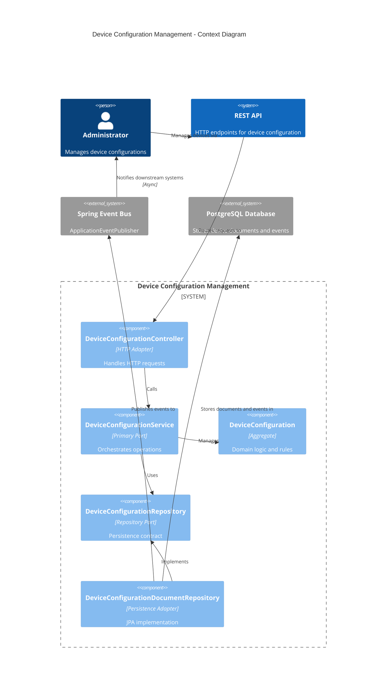
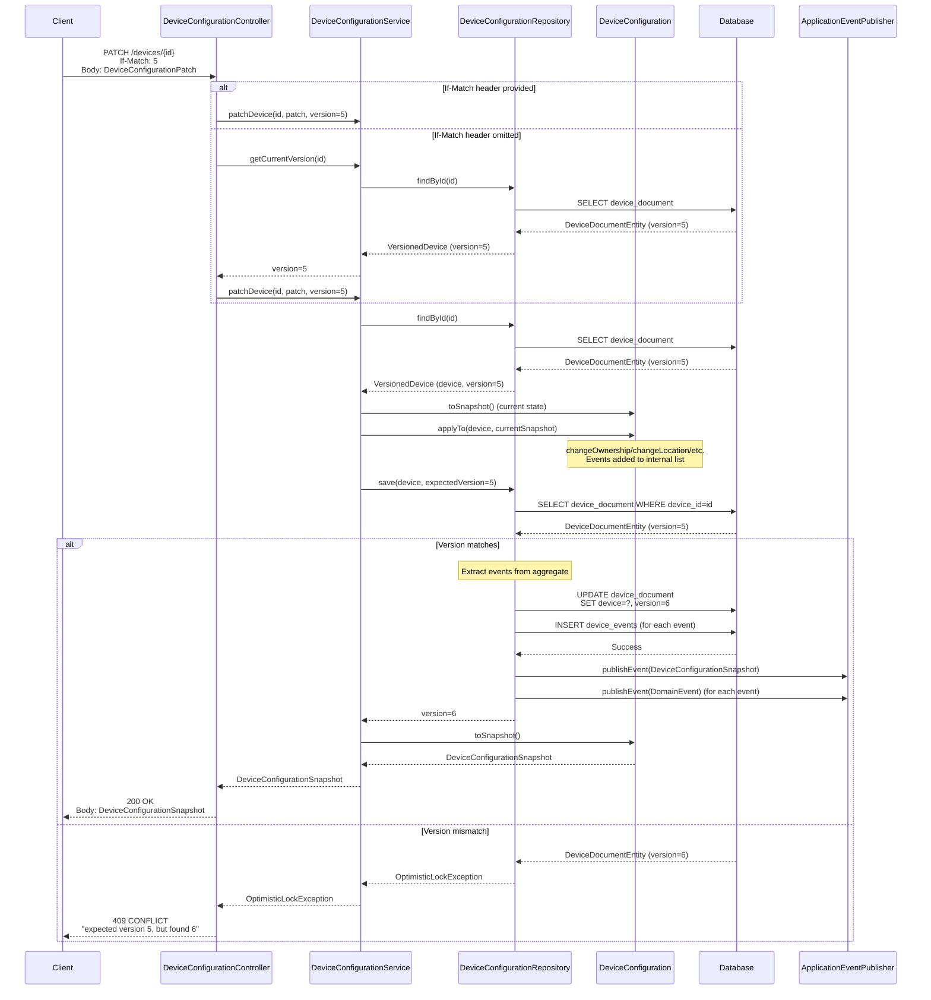

# Device Configuration Management

## Overview

This module manages the configuration lifecycle of devices in the system. It handles device ownership, location, operating hours, and operational settings, ensuring that devices are properly configured and validated before they can be used by customers.

### Business Purpose

The module solves the problem of managing device configurations in a distributed system where:
- Devices can be owned by operators and providers (or remain unowned)
- Devices must have valid configurations (location, ownership, settings) to be usable
- Configuration changes must be tracked and validated
- Concurrent updates must be handled safely using optimistic locking
- Configuration violations must be detected and affect device visibility

### Key Problems Solved

1. **Configuration Management**: Centralized management of device properties (ownership, location, opening hours, settings)
2. **Validation**: Automatic detection of configuration violations (missing ownership, location, invalid settings combinations)
3. **Concurrency Control**: Optimistic locking prevents lost updates when multiple clients modify the same device
4. **Event-Driven Architecture**: All configuration changes emit domain events for downstream consumers
5. **Visibility Calculation**: Automatic computation of device visibility based on violations and settings

## Key Components

### Aggregate: `DeviceConfiguration`

The core domain aggregate that encapsulates device configuration state and business rules. It is package-private and accessed only through the service layer.

**Responsibilities:**
- Maintains device state (ownership, location, opening hours, settings)
- Enforces business rules (e.g., resetting to defaults when ownership is removed)
- Emits domain events for state changes
- Computes violations and visibility

**Key Methods:**
- `newDevice(String deviceId)`: Factory method to create a new device with default configuration
- `changeOwnership(Ownership)`: Updates ownership and resets to defaults if unowned
- `changeLocation(Location)`: Updates device location
- `changeOpeningHours(OpeningHours)`: Updates operating hours
- `changeSettings(Settings)`: Updates device settings
- `toSnapshot()`: Creates an immutable snapshot with violations and visibility

### Service (Primary Port Implementation): `DeviceConfigurationService`

The primary port implementation that orchestrates device configuration operations. Acts as a facade for the module.

**Key Operations:**
- `createDevice(String deviceId)`: Creates a new device configuration
- `getDevice(String deviceId)`: Retrieves device configuration snapshot
- `updateOwnership(String deviceId, Ownership, long version)`: Updates ownership with optimistic locking
- `updateLocation(String deviceId, Location, long version)`: Updates location with optimistic locking
- `updateOpeningHours(String deviceId, OpeningHours, long version)`: Updates opening hours with optimistic locking
- `updateSettings(String deviceId, Settings, long version)`: Updates settings with optimistic locking
- `patchDevice(String deviceId, DeviceConfigurationPatch, long version)`: Partial update via PATCH
- `deleteDevice(String deviceId, long version)`: Deletes device with optimistic locking
- `listDevices(Pageable)`: Paginated list of all devices
- `getCurrentVersion(String deviceId)`: Retrieves current version for optimistic locking

### HTTP Adapter: `DeviceConfigurationController`

REST API controller that exposes device configuration operations via HTTP.

**Endpoints:**
- `GET /devices/{deviceId}`: Retrieve device configuration
- `PATCH /devices/{deviceId}`: Update device configuration (supports `If-Match` header for optimistic locking)

### Repository Port: `DeviceConfigurationRepository`

Interface defining the contract for device persistence operations.

**Methods:**
- `findById(String deviceId)`: Returns `Optional<VersionedDevice>` with device and version
- `save(DeviceConfiguration device, Long expectedVersion)`: Saves device with optional optimistic lock check
- `delete(String deviceId, long expectedVersion)`: Deletes device with optimistic lock check
- `exists(String deviceId)`: Checks if device exists
- `findAll(Pageable)`: Paginated list of devices

### Persistence Adapter: `DeviceConfigurationDocumentRepository`

JPA-based implementation that stores device configurations as JSONB documents and events in separate tables.

**Storage Strategy:**
- **Device Document**: Stored in `device_document` table as JSONB (`JsonBinaryType`)
- **Events**: Stored in `device_events` table with type, timestamp, and JSONB payload
- **Optimistic Locking**: Uses JPA `@Version` annotation for automatic version management

**Event Publishing:**
- Publishes domain events via `ApplicationEventPublisher` (Spring's internal event bus)
- Publishes `DeviceConfigurationSnapshot` after successful save
- Events are persisted to database before publishing

**Embedded Entities:**
- `DeviceDocumentEntity`: JPA entity for device document storage
- `DeviceEventEntity`: JPA entity for event storage
- `DocumentRepository`: JPA repository interface for documents
- `EventRepository`: JPA repository interface for events

### Value Objects

#### `Ownership`
Immutable record representing device ownership by operator and provider.

**Business Rule**: Both `operator` and `provider` must be either both null (unowned) or both non-null (owned).

**Factory Methods:**
- `unowned()`: Creates unowned ownership
- `of(String operator, String provider)`: Creates owned ownership

#### `Location`
Immutable record representing device physical location.

**Components:**
- `street`, `houseNumber`, `city`, `postalCode`, `state`, `country`
- `coordinates`: Mandatory `Coordinates` object

#### `Coordinates`
Immutable record representing geographic coordinates.

**Validation:**
- Latitude: -90 to 90
- Longitude: -180 to 180

#### `OpeningHours`
Immutable record representing device operating hours.

**Factory Methods:**
- `alwaysOpened()`: Creates always-open configuration
- `of(boolean alwaysOpen)`: Creates custom configuration

#### `Settings`
Immutable record representing device operational settings.

**Fields:**
- `autoStart`: Automatic start capability
- `remoteControl`: Remote control enabled
- `billing`: Billing enabled
- `reimbursement`: Reimbursement enabled
- `showOnMap`: Visible on map
- `publicAccess`: Public access enabled

**Factory Methods:**
- `defaultSettings()`: All settings set to `false`

#### `DeviceConfigurationSnapshot`
Immutable record representing a complete device configuration snapshot.

**Contains:**
- Device ID
- Ownership, Location, OpeningHours, Settings
- `Violations`: Current configuration violations
- `Visibility`: Calculated visibility status

#### `DeviceConfigurationPatch`
Record representing a partial update request.

**Fields:** All nullable (ownership, location, openingHours, settings)

**Nested `PartialSettings`**: Allows partial updates to settings (all fields nullable `Boolean`)

**Method:**
- `applyTo(DeviceConfiguration, DeviceConfigurationSnapshot)`: Applies patch to device aggregate

#### `Visibility`
Immutable record representing device visibility and usability.

**Enum `ForCustomer`:**
- `USABLE_AND_VISIBLE_ON_MAP`: Device is usable and shown on map
- `USABLE_BUT_HIDDEN_ON_MAP`: Device is usable but hidden from map
- `INACCESSIBLE_AND_HIDDEN_ON_MAP`: Device is not usable

**Calculation:** Based on violations, `publicAccess`, and `showOnMap` settings

#### `Violations`
Immutable record tracking configuration violations.

**Violation Types:**
- `operatorNotAssigned`: Operator is missing
- `providerNotAssigned`: Provider is missing
- `locationMissing`: Location is not set
- `showOnMapButMissingLocation`: Map visibility enabled but no location
- `showOnMapButNoPublicAccess`: Map visibility enabled but public access disabled

**Method:**
- `isValid()`: Returns `true` if no violations exist

#### `VersionedDevice`
Wrapper record combining device configuration with its version number.

**Used for:** Optimistic locking and version tracking

### Exceptions

#### `DeviceNotFoundException`
Thrown when attempting to access a non-existent device.

#### `DeviceAlreadyExistsException`
Thrown when attempting to create a device that already exists.

#### `OptimisticLockException`
Thrown when optimistic locking fails (expected version doesn't match actual version).

**HTTP Mapping:** Returns `409 CONFLICT` status

## Business Rules

### Ownership Rule

**Rule**: Ownership must be both null (unowned) or both non-null (owned). Partial ownership is invalid.

**Enforcement**: Validated in `Ownership` record constructor

**Side Effect**: When ownership changes to unowned, device configuration is automatically reset to defaults:
- Location: `null`
- OpeningHours: `alwaysOpened()`
- Settings: `defaultSettings()`

### Violations Computation

Violations are computed by `DeviceConfiguration.checkViolations()`:

1. **Operator/Provider Missing**: Both are missing if ownership is unowned
2. **Location Missing**: Location is `null`
3. **Show on Map but Missing Location**: `showOnMap` is `true` but location is `null`
4. **Show on Map but No Public Access**: `showOnMap` is `true` but `publicAccess` is `false`

### Visibility Calculation

Visibility is calculated by `Visibility.calculateFrom()` based on:

1. **Is Usable**: `violations.isValid() && publicAccess`
2. **For Customer**:
   - If not usable → `INACCESSIBLE_AND_HIDDEN_ON_MAP`
   - If usable and `showOnMap` → `USABLE_AND_VISIBLE_ON_MAP`
   - If usable and not `showOnMap` → `USABLE_BUT_HIDDEN_ON_MAP`
3. **Roaming Enabled**: Same as `isUsable`

### Optimistic Locking

**Mechanism**: Uses JPA `@Version` annotation on `DeviceDocumentEntity`

**How it works**:
- Every persisted device document has a monotonically increasing `@Version` (managed by JPA).
- When saving, the repository compares the provided `expectedVersion` with the current stored version.
- If the versions differ → `OptimisticLockException` → HTTP `409 CONFLICT`.

**`If-Match` behavior in this module**:
- The `If-Match` header is optional.
- If `If-Match` is provided, its numeric value is used as `expectedVersion`.
- If `If-Match` is omitted, the controller first reads the **current** version and then proceeds with the update using that version.

**Important note**:
- The `GET /devices/{deviceId}` endpoint returns only a `DeviceConfigurationSnapshot` (no version/ETag). If a client wants strict optimistic locking, it must obtain the version through some other mechanism (e.g., application state, an enhanced API that returns `ETag`, etc.). Omitting `If-Match` still protects against lost updates in the narrow window between the controller’s version read and the repository save.

## API

### GET /devices/{deviceId}

Retrieves a device configuration snapshot.

**Request:**
- Path parameter: `deviceId` (String)

**Response:**
- Status: `200 OK`
- Body: `DeviceConfigurationSnapshot` (JSON)

**Example Response:**
```json
{
  "deviceId": "device-123",
  "ownership": {
    "operator": "operator-1",
    "provider": "provider-1"
  },
  "location": {
    "street": "Main St",
    "houseNumber": "123",
    "city": "Warsaw",
    "postalCode": "00-001",
    "state": "Mazowieckie",
    "country": "Poland",
    "coordinates": {
      "longitude": 21.0122,
      "latitude": 52.2297
    }
  },
  "openingHours": {
    "alwaysOpen": true
  },
  "settings": {
    "autoStart": false,
    "remoteControl": true,
    "billing": true,
    "reimbursement": false,
    "showOnMap": true,
    "publicAccess": true
  },
  "violations": {
    "operatorNotAssigned": false,
    "providerNotAssigned": false,
    "locationMissing": false,
    "showOnMapButMissingLocation": false,
    "showOnMapButNoPublicAccess": false
  },
  "visibility": {
    "forCustomer": "USABLE_AND_VISIBLE_ON_MAP",
    "roamingEnabled": true
  }
}
```

**Error Responses:**
- `404 NOT FOUND`: Device does not exist

### PATCH /devices/{deviceId}

Partially updates device configuration.

**Request:**
- Path parameter: `deviceId` (String)
- Header: `If-Match` (Long, optional) - Expected version for optimistic locking
- Body: `DeviceConfigurationPatch` (JSON)

**Request Body Structure:**
```json
{
  "ownership": {
    "operator": "operator-1",
    "provider": "provider-1"
  },
  "location": {
    "street": "Main St",
    "houseNumber": "123",
    "city": "Warsaw",
    "postalCode": "00-001",
    "state": "Mazowieckie",
    "country": "Poland",
    "coordinates": {
      "longitude": 21.0122,
      "latitude": 52.2297
    }
  },
  "openingHours": {
    "alwaysOpen": false
  },
  "settings": {
    "autoStart": true,
    "remoteControl": null,
    "billing": null,
    "reimbursement": null,
    "showOnMap": null,
    "publicAccess": null
  }
}
```

**Note**: All fields in the patch are optional. Only provided fields are updated. For `settings`, use `null` to keep existing values.

**Response:**
- Status: `200 OK`
- Body: `DeviceConfigurationSnapshot` (JSON) - Updated configuration

**Optimistic Locking Behavior:**
- If `If-Match` header is provided: Uses that version for optimistic lock check
- If `If-Match` header is omitted: Fetches current version first, then uses it for optimistic lock check
- If version mismatch: Returns `409 CONFLICT` with error message

**Error Responses:**
- `404 NOT FOUND`: Device does not exist
- `409 CONFLICT`: Optimistic lock failed (version mismatch)

**Example with Optimistic Locking:**
```http
PATCH /devices/device-123
If-Match: 5
{
  "settings": {
    "showOnMap": true
  }
}
# If version is still 5 → Success, returns updated snapshot
# If version changed to 6 → 409 CONFLICT
```

**Example without `If-Match` (server chooses current version):**
```http
PATCH /devices/device-123
{
  "settings": {
    "showOnMap": true
  }
}
# Usually succeeds, but may still return 409 if another update happens
# between the controller's version read and the save.
```

## Persistence & Eventing

### Document Storage

Device configurations are stored as JSONB documents in the `device_document` table:

**Table Structure:**
- `device_id` (String, Primary Key)
- `version` (Long, managed by JPA `@Version`)
- `device` (JSONB, stores serialized `DeviceConfiguration`)

**Storage Technology:**
- Uses Hibernate's `JsonBinaryType` for JSONB support
- Aggregate is serialized as a single JSON document
- Version field enables optimistic locking

### Event Storage

Domain events are stored in the `device_events` table:

**Table Structure:**
- `id` (UUID, Primary Key)
- `device_id` (String)
- `type` (String, event type name)
- `time` (Instant, event timestamp)
- `event` (JSONB, stores serialized `DomainEvent`)

**Event Types:**
- `DeviceCreated_v1`
- `OwnershipChanged_v1`
- `LocationChanged_v1`
- `OpeningHoursChanged_v1`
- `SettingsChanged_v1`
- `DeviceConfigurationChanged_v1`

**Event Type Resolution:**
- Uses `EventTypes` utility from `devices.configuration.tools` package
- Maps event class to type name via Jackson `@JsonSubTypes` annotations

### Event Publishing Flow

1. **Domain Changes**: Aggregate methods (`changeOwnership`, `changeLocation`, etc.) add events to internal list
2. **Save Operation**: `DeviceConfigurationDocumentRepository.save()` extracts events from aggregate
3. **Persistence**: Events are saved to `device_events` table
4. **Publishing**: Two types of events are published via `ApplicationEventPublisher`:
   - Individual domain events (`DomainEvent` instances)
   - Configuration snapshot (`DeviceConfigurationSnapshot`) - published once if any events were emitted

**Event Consumption:**
- Events are published to Spring's `ApplicationEventPublisher` (internal event bus)
- Downstream consumers can subscribe using `@EventListener` annotations
- Events can be forwarded to external systems (e.g., Kafka) by other adapters

**Transaction Boundary:**
- All operations (`save`, event persistence, publishing) occur within a single `@Transactional` boundary.
- Events are **published inside the transaction** (via `ApplicationEventPublisher`), before the database commit happens.
  - If an event consumer needs “after commit” semantics, it should use Spring’s transactional event support (e.g., `@TransactionalEventListener(phase = AFTER_COMMIT)`) or an outbox-style integration.

## Diagrams

### C4 Context Diagram



### Sequence Diagram: PATCH Flow with Optimistic Locking



## External Collaborators

This module integrates with the following external systems and frameworks:

- **Spring MVC**: HTTP request handling (`@RestController`, `@GetMapping`, `@PatchMapping`)
- **Spring Data JPA**: Persistence abstraction (`JpaRepository`)
- **Hibernate**: ORM with JSONB support (`JsonBinaryType`)
- **Spring ApplicationEventPublisher**: Internal event bus for domain event publishing
- **EventTypes** (`devices.configuration.tools`): Utility for event type name resolution
